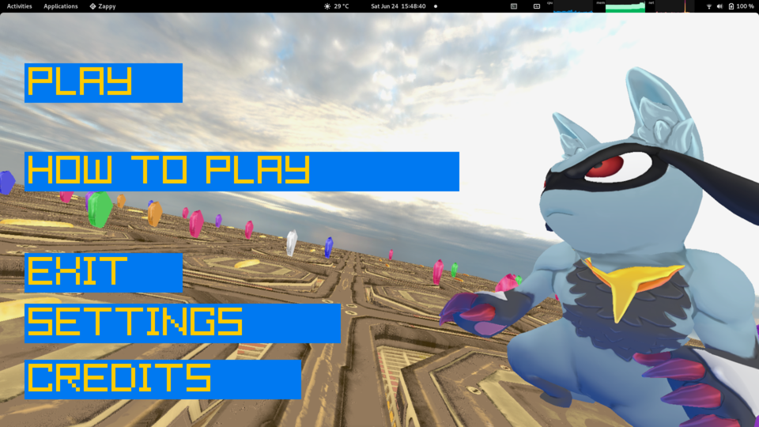
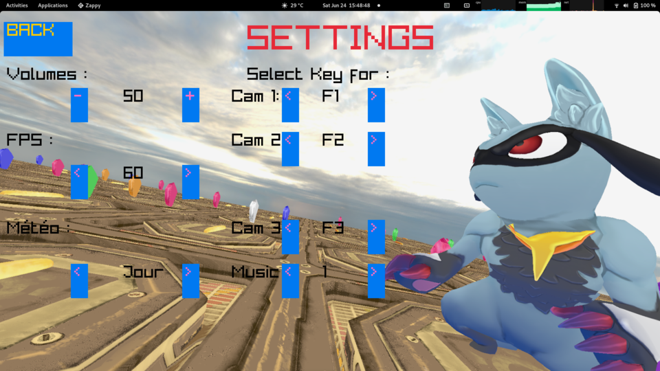
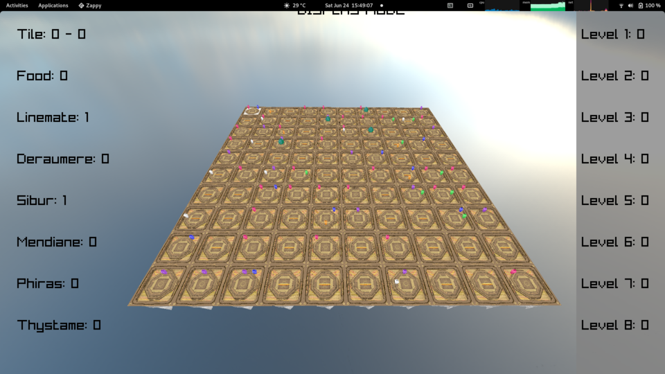

# Zappy - Graphical Client

## Introduction

This is the graphical client of the Zappy project. It is written in C++ with the Raylib library for Graphical User Interface.

The aim of this part of the project is to provide a graphical interface to the user in order to play the game.


## How to execute the client

### Requirements

- Have the server running in order to connect to it when you play

### Execution

- Run the client with the following command:
```
./zappy_gui -p <port> -h <hostname>

-p port number
-h name of the host machine
```

> :bulb: The port must be the same as the one used by the server and between 1 and 65535, and you may need root privileges to use a port below 1024.

#### Example

```
Server : ./zappy_server -p 4242 -x 10 -y 10 -n team1 team2 -c 2 -f 10
Graphical : ./zappy_gui -p 4242 -h 127.0.0.1
```

## How to play

### Controls

- ***ESC*** : to quit the game

- ***P*** : to go back to the menu

- ***Backspace*** : to go back to Settings

- ***Arrow keys*** : to move the camera or select a tile in the map

- ***QZSD keys*** : to zoom in and out

- ***F1 key*** : to select a player's view

- ***F2 key*** : to select a different player's view

- ***F3 key*** : to select the global view

- ***F4 key*** : to decrease the speed of the game

- ***F5 key*** : to increase the speed of the game

### Menu

- ***Play*** : to start the game

- ***Settings*** : to change the settings of the game

- ***Exit*** : to quit the game

- ***How to play*** : to display the controls

- ***Credits*** : to display the credits

### Settings

- ***Volume*** : to change the volume of the game

- ***FPS*** : to change the FPS of the game

- ***Weather*** : to change the wheather of the game (DAY, NIGHT)

- ***Music*** : to change the music of the game

- ***Keybindings*** : to change the keybindings of the game

### Game

The Game is composed of 3 views:

- ***Global view*** : to see the whole map

- ***Player view*** : to see the view of a player

- ***Display mode*** : to see the whole map and see the levels of the players and ressources on X Y tile's coordinates

## Screenshots

***Menu***



***Settings***



***Game***



## Authors

- **Taha ALANI**
- **Kévin NADARAJAH**


