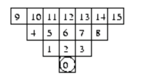

# Zappy Server

The Zappy's server is the core of the project.

The goal of the server is to manage the game and the communication between the clients, which can be either AI players or graphical clients.

## Configuration

When launching the server, you can specify different options.

You can retrieve all of them using the following syntax:

```bash
./zappy_server -help
```

#### Table of contents

- [Connectivity](#connectivity)
- [Map size](#map-size)
- [Teams](#teams)
- [Teams capacity](#teams-capacity)
- [Frequency](#frequency)
- [Immortal mode](#immortal-mode)
- [Debug mode](#debug-mode)
- [Custom seed](#custom-seed)

### Connectivity

You can use the `-p` (`--port`) option to define a specific port for the server.

> :bulb: The default port is 4242.

> :warning: The port must be between 1 and 65535, and you may need root privileges to use a port below 1024.

### Map size

The map size can be edited using the `-x` (``--width``) and `-y` (``--height``) options.

> :bulb: The default map size is 10x10.

> :wrench: The minimum map size is **1x1**, and the maximum map size is **100x100**.

### Teams

You can define the teams that will be available in the game using the `-n` (`--names`) option.

To use it, you have to chain the names of the teams, separated by a space.

:mag: Example: `./zappy_server -n my_team my_second_team my_third_team`

> :bulb: The default teams are `Team1`, `Team2`, `Team3` and `Team4`."

> :warning: The team name `GRAPHIC` is reserved for the graphical client.

> :information_source: A total of 100 teams can be created.

### Teams capacity

You can set the maximum number of players per team using the `-c` (`--clients`) option.

> :bulb: The default number of players per team is 4.

> :rocket: The maximum number of players per team is 100, totalizing a maximum of **10,000** players.

### Frequency

You can set the frequency of the game using the `-f` (`--frequency`) option.

Please take a look at the [Server/AI Communication Protocol](./README.md#server--ai-communication-protocol) for more information about the frequency.

> :bulb: The default frequency is 100.

> :wrench: The maximum frequency is 10,000.

### Immortal mode

You can enable the immortal mode using the `--immortal` option.

In this mode, the players will consume food, which is their only way to die on **Trantor**.

### Debug mode

You can enable the debug mode using the `--debug` option.

This mode allows developers to get more information about the game.

The debug mode show the following information:

- Resources map refills
- Incantation status and verifications

### Custom seed

You can set a custom seed for the random number generator using the `--seed` option.

## Connection

When a client successfully connects to the server, it should receive a welcome message.
The client must then identify itself, either by sending its team name or by sending the graphical identifier: `GRAPHIC`.

> :warning: All instructions sent to the server must end with a newline character (`\n`). All responses from the server will also end with a newline character.

The protocol used for communication is detailed in the [Server/AI Communication Protocol](./README.md#server--ai-communication-protocol) and [Server/Graphic Communication Protocol](./README.md#server--graphical-communication-protocol) sections, depending on the type of client.

## Server / AI Communication Protocol

The communication protocol between AI clients and the server follows some rules:

- The AI player can send actions to the server. Each action has a specific duration, within which the player cannot do another action.
- The server can send messages to the AI player, in form of events: for example when the player received a message, or when he *died*.
- When doing an action, the client will still receive events and can still send actions to the server. However, the actions will execute one by one in the order they were sent, with a limit of 10 incoming actions. If the limit is reached, **the server will ignore the player requests** until the current action is done.

> :information_source: The duration of each action is defined by the frequency of the server. For example, an action with a duration of 7 will last 7 / frequency seconds.

Here is the list of the commands that can be sent by the AI player to the server.

| Command           | Duration | Description                                   | Response Format                                          |
|-------------------|----------|-----------------------------------------------|----------------------------------------------------------|
| Forward           | 7f       | Move forward                                  | ok                                                       |
| Left              | 7f       | Rotate 90° left                               | ok                                                       |
| Right             | 7f       | Rotate 90° right                              | ok                                                       |
| Look              | 7f       | Look around                                   | [see below](#look)                                       |
| Inventory         | 1f       | Get inventory                                 | [see below](#inventory)                                  |
| Broadcast \<text> | 7f       | Broadcast a message                           | ok                                                       |
| Connect_nbr       | 0f       | Get the number of available slots in the team | (number)                                                 |
| Fork              | 42f      | Fork a new player                             | ok                                                       |
| Eject             | 7f       | Eject a player from the tile                  | ok                                                       |
| Take \<item>      | 7f       | Take a resource from the tile                 | ok / ko                                                  |
| Set \<item>       | 7f       | Set a resource on the tile                    | ok / ko                                                  |
| Incantation       | 300f     | Start an incantation                          | Elevation underway<br/>Current level: (number)<br/> / ko |

In addition to the command responses, the server can send the following events to the AI player:

| Event                           | Description                 |
|---------------------------------|-----------------------------|
| message \<orientation>, \<text> | Received a message          |
| eject: \<number>                | Player eject from direction |
| dead                            | Death of the player         |

### Map

The map is a square of size `width` x `height`. The four sides of the map are connected, so that a player can move from one side to another.

> :bulb: A player that moves on the right side of the map will appear on the left side of the map, and so on.

There is seven types of resources on the map:

- Food
- Linemate
- Deraumere
- Sibur
- Mendiane
- Phiras
- Thystame

### Look

The `Look` command returns the content of the tiles around the player. Depending on the level of the player, he will see further.

The format of the response is the following:

```
[player food linemate,,player,food]
```

Each tile is separated by a comma, and each resource within the same tile is separated by a space.

The position of the tiles follow this schema:



> :bulb: A player that is at level 1 will see tiles 0, 1, 2 and 3 according to its position and orientation. The range increases by one for each level.

> :information_source: The player that executes the command sees himself in the first tile.

### Inventory

The `Inventory` command returns the content of the player inventory.

The format of the response is the following:

```
[food 19, linemate 8, deraumere 0, sibur 0, mendiane 0, phiras 0, thystame 0]
```

> :bulb: Every resource is shown even if the player doesn't have it in his inventory

## Server / Graphical Communication Protocol
